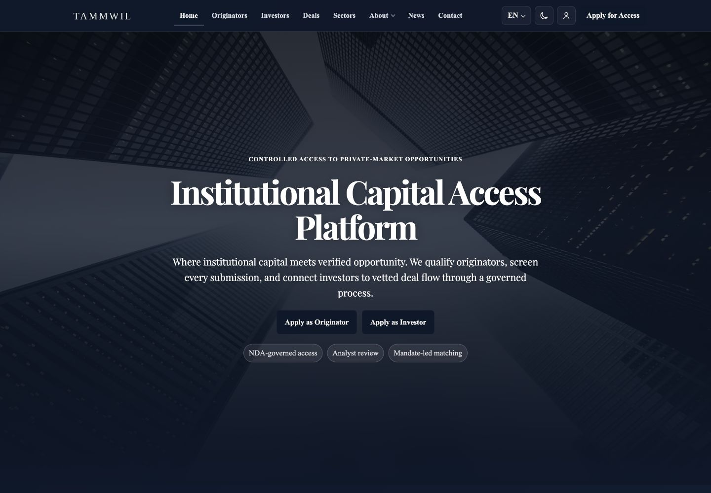
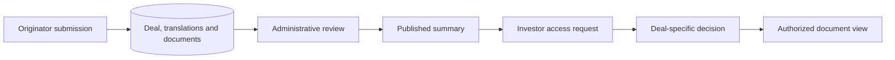
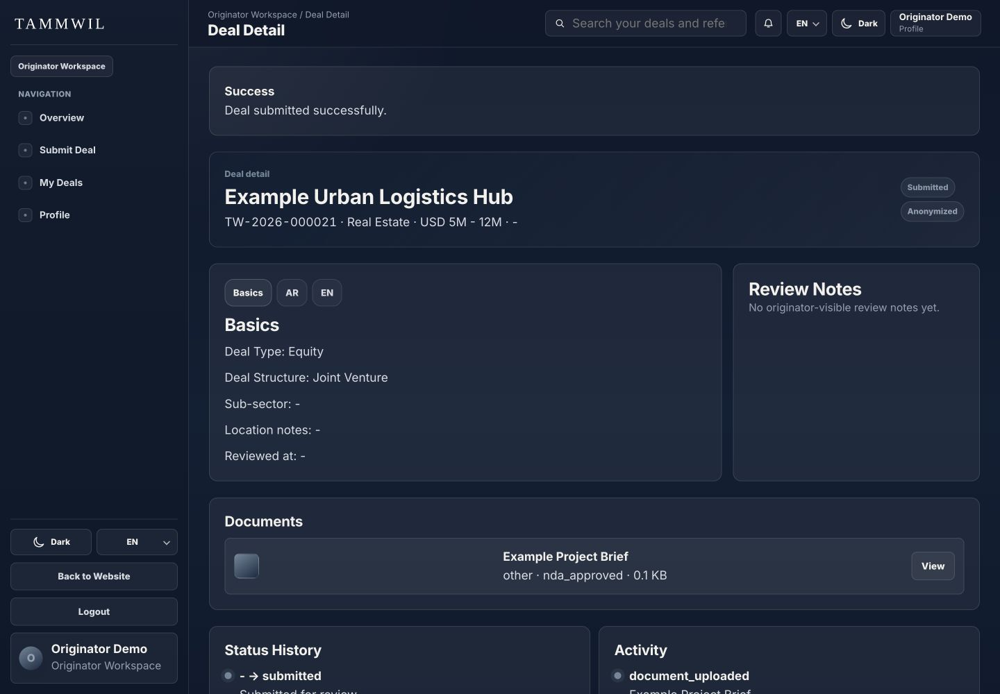
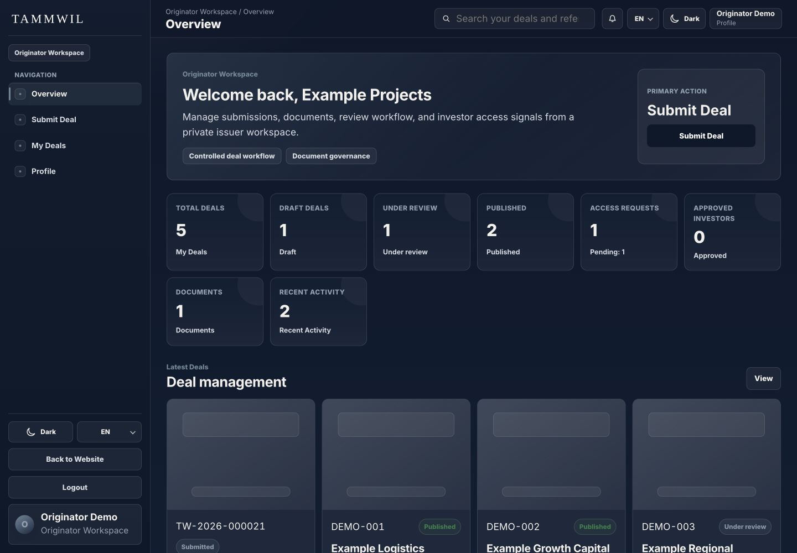
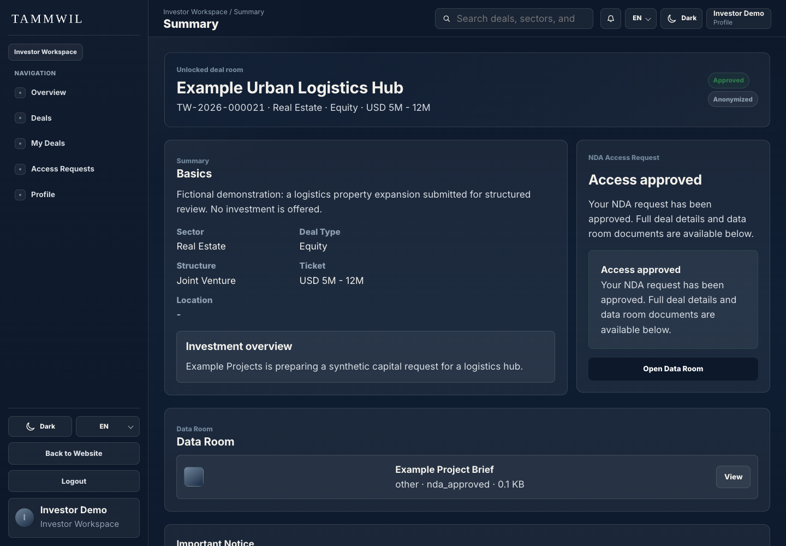
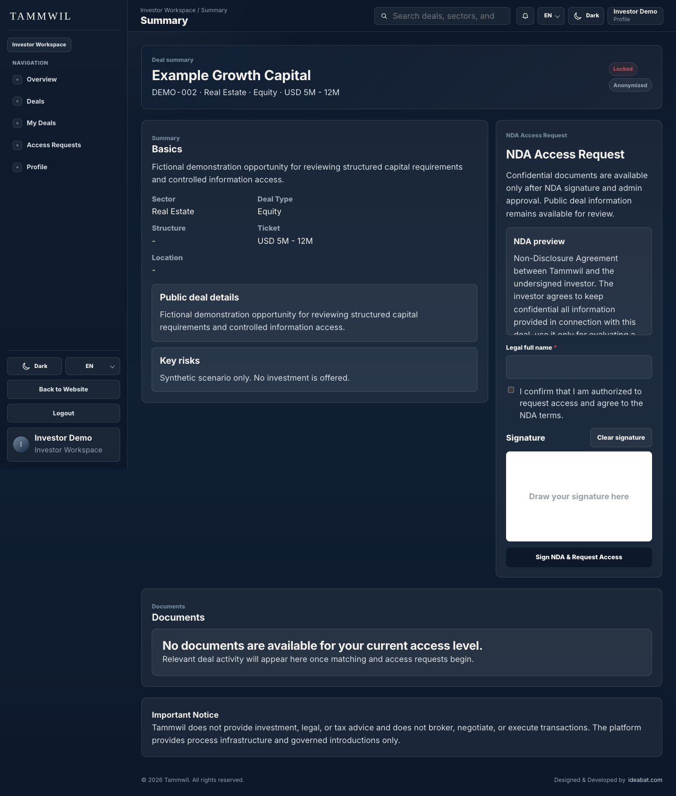
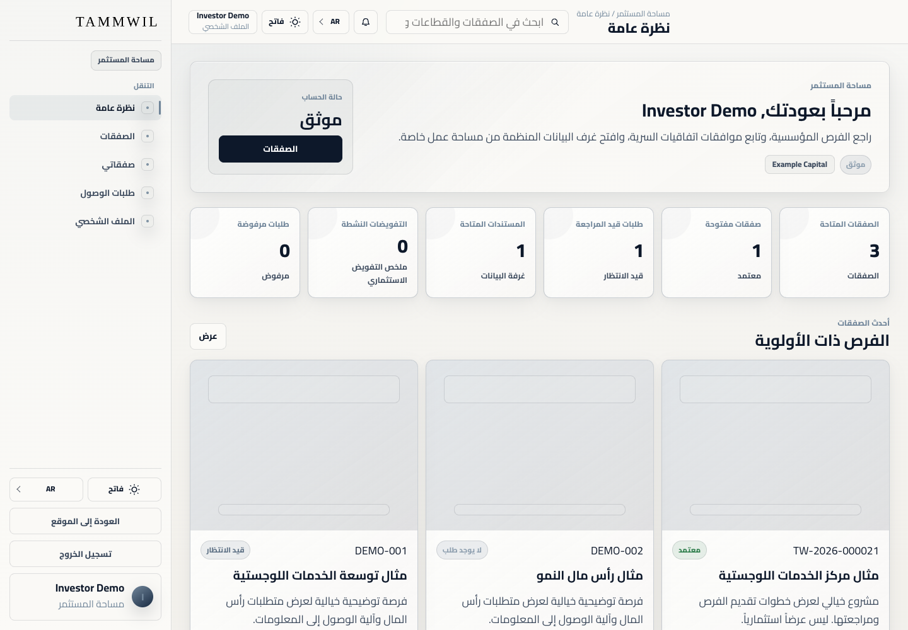
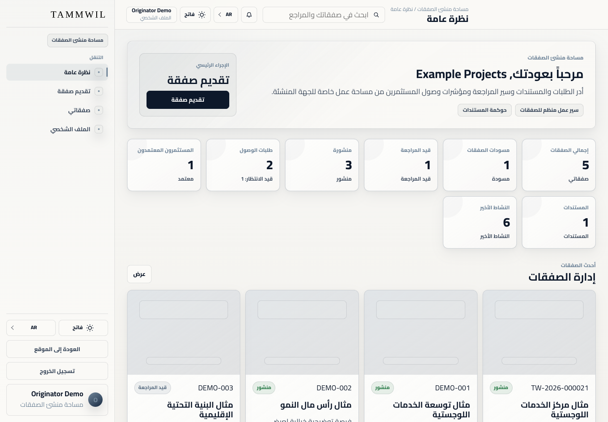

# Tammwil

A bilingual client platform for opportunity submission, administrative review and deal-specific investor access.

This is a documentation and visual showcase. The application source code is not included. Technical descriptions and earlier test results come from the prepared project documentation; those application tests were not repeated for this export.

**Portfolio:** [English](https://ideabat.com/portfolio/tammwil-private-market-platform/) · [Türkçe](https://ideabat.com/tr/portfolio/tammwil-private-market-platform/) · [العربية](https://ideabat.com/ar/portfolio/tammwil-private-market-platform/)

**Case study:** [English](https://ideabat.com/case-study/tammwil-governed-deal-access/) · [Türkçe](https://ideabat.com/tr/case-study/tammwil-governed-deal-access/) · [العربية](https://ideabat.com/ar/case-study/tammwil-governed-deal-access/)

## Ragıp Mullamusa’s contribution

I built Tammwil as a client delivery through Ideabat: the public website, originator and investor workspaces, administration, shared PHP authentication, PDO data access, document handling and English/Arabic interface. Ideabat’s role is software development; the client’s business and investment decisions remain separate.

## Four surfaces around one opportunity

| Surface | Purpose |
|---|---|
| Public website | Introduce the platform and published opportunities |
| Originator workspace | Prepare bilingual information and supporting documents |
| Administration | Review submissions, record decisions and manage publication |
| Investor workspace | Browse summaries and request deal-specific access |

## Architecture and access decisions

This conceptual model separates publication from document access. A public summary does not confer permission to read every attachment. The PHP/PDO application connects decisions to the same deal identity, while the file retrieval path evaluates the current user and access state. English and Arabic content remain translations of one opportunity, not competing records. PHPMailer is an integration boundary; the documentation does not establish live message delivery or legally effective agreement execution.

## Context and objective

Tammwil is a client platform developed by Ideabat for institutional opportunity workflows. The software serves three different responsibilities: preparing opportunity information, reviewing it, and making appropriate information available to investors. Its public website introduces the platform and published opportunities.

The implemented workflow implies a clear software problem: a submission, a review decision and an access request must remain connected to the same opportunity. This case study explains that implementation; it does not claim a customer interview, a measured before/after result or ownership of the client’s business.

## Preparing one coherent opportunity record

The originator form separates classification, ticket range/location, English content, Arabic content, documents and final submission. Server-side validation checks required taxonomies and the ticket range. The creation handler groups deal records, localized content, document metadata and status history in a database transaction.

*The real browser submission saved a bilingual fictional logistics opportunity and a CSV brief.*

The shared deal identity lets the originator return to its detail view and lets administration find the same item in a review queue. The result is traceable software state rather than an isolated form response.

## Review and publication are explicit states

The administrative workspace exposes pending applications, deals awaiting review and access requests. Review actions can record notes and update deal status; publication makes eligible opportunities available to the catalogue.

The documented local review persisted the published status.

## Investor access is a separate decision

Investors can explore published summaries without automatically receiving every associated document. The request model stores a deal-specific access state; the interface distinguishes locked and approved views.

*Locked opportunity and the implemented access-request form. No legal agreement was signed in this demonstration.*

The document endpoint checks the user role, ownership, publication state and approved investor request before resolving the file within the document directory. Focused local HTTP checks returned 403 before approval and the synthetic CSV after approval. This establishes the tested path, not a complete security audit.

*Approved investor detail with the associated example document.*

## Architecture, localization and constraints

The four surfaces share PHP bootstrap/authentication helpers, PDO queries and a relational MySQL-compatible database. The same server-rendered application serves public visitors and role-specific workspaces. Custom JavaScript handles the stepper, tabs, menus and theme switching. Translation tables and locale-specific CSS support English/LTR and Arabic/RTL presentation.

*Arabic originator workspace using the actual light theme. Some labels may retain English fallbacks.*

PHPMailer provides application/contact notification paths, but SMTP was disabled for this local review. Files and sessions stayed in a disposable runtime. The supplied database export was used only for schema and approved reference dictionaries, never customer records.

## Delivered capability and verification

The delivery connects submission, review, publication and document-access states around shared opportunity records. All four surfaces opened locally. A real browser submitted the bilingual deal and uploaded its document; administration approved/published it; an investor opened locked and approved screens. Syntax checks passed on 185 PHP files, alongside selected authentication and access tests.

No quantified business result, financial return, automated matching capability or production-scale claim is made. Full onboarding, legal NDA execution, live mail and exhaustive CMS/mobile testing remain outside this verification. The public URL is owner-confirmed; launch dates and current maintenance status are not supplied.

[Visit Tammwil](https://tammwil.com) · [Discuss operational software with Ideabat](https://ideabat.com)

If your application spans submission, review and controlled information sharing, start by defining which record and decision each interface owns. Ideabat can discuss the software scope with you.

## Screen walkthrough

These real application captures come from the project’s prepared publication material. Demonstration records are synthetic; a screen illustrates the interface, not a production deployment or a permission test.

### 01 — Tammwil public homepage in Tammwil, using fictional demonstration data.

### 02 — Submitted opportunity and document history in Tammwil, using fictional demonstration data.

### 03 — Originator submission overview in Tammwil, using fictional demonstration data.

### 04 — Approved investor deal detail in Tammwil, using fictional demonstration data.

### 05 — Deal-specific access request boundary in Tammwil, using fictional demonstration data.

### 06 — Arabic investor overview in light theme in Tammwil, using fictional demonstration data.

### 07 — Arabic originator overview in light theme in Tammwil, using fictional demonstration data.

## Evidence and availability

Implementation and historical validation descriptions above are supported by the project’s prepared documentation. The application tests were not rerun for this documentation export. The screenshots demonstrate the captured version, not current service availability, customer adoption or measured commercial outcomes.

## Ownership and technical review

This repository contains documentation and approved visual material, not an application source release. Presentation through Ideabat does not transfer a client’s ownership. For employment, collaboration or technical-review inquiries, contact Ragıp Mullamusa through Ideabat. Access to client-owned source requires prior permission from the project owner and compliance with applicable confidentiality requirements. Requests are reviewed individually; source access is not guaranteed. No software license or redistribution permission is granted by this showcase.

## Contact

Ragıp Mullamusa is the founder of [Ideabat](https://ideabat.com/). For relevant engineering, employment or collaboration inquiries, use [the contact page](https://ideabat.com/contact-us/) or [info@ideabat.com](mailto:info@ideabat.com).
